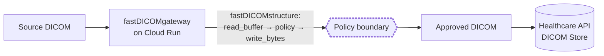

# fastDICOMgateway

**Status: evidence-backed demonstration, not a production service.**

## What this demonstrates

> A DICOM object can be inspected and transformed before intentional durable persistence, so that
> the persistence system receives the approved representation rather than the original source
> representation.

`fastDICOMgateway` is a reference application that first proves the mechanism (parse → policy →
write, entirely in memory), then carries it through four progressively stronger execution
boundaries — a bare local process, a container, Google Cloud Run's managed ingress, and finally a
real durable sink (a GCP Healthcare API DICOM store) — independently checking at each one whether
anything from the original source object leaked into logs, the filesystem, or the durable store
itself. See [Evidence](#evidence) for the result at each stage.

## Architecture

```text
   SOURCE SIDE                                          PERSISTENT SIDE

   source DICOM
        |
        v
┌──────────────────────┐
│  fastDICOMgateway     │   read_buffer() → policy mutation → write_bytes()
│  (Cloud Run)          │   using fastDICOMstructure — verified by reparse
└──────────────────────┘
        |
   ════ POLICY BOUNDARY ════   <- nothing crosses this line unless the policy approved it
        |
        v
   approved DICOM  ─────────────────────────────────►  Healthcare API DICOM Store
```



The only thing that ever reaches the Healthcare API DICOM store is what comes out the right side of
the policy boundary. Nothing downstream of it — logs, the durable store, Cloud Run's own request
log — was found to contain the source representation; see [Evidence](#evidence).

## Demonstration policy

Deliberately small and explicit — not a general policy engine:

| Action | Tag |
|---|---|
| Remove, any nesting depth | `PatientName` (0010,0010) |
| Replace with `DEMO`, any nesting depth | `PatientID` (0010,0020) |
| Remove if present, any nesting depth | `PatientBirthDate` (0010,0030) |
| Remove | every private element (odd group number, any nesting depth) |
| Preserve unchanged | Pixel Data (7FE0,0010) |
| Preserve unchanged | everything else, per `fastDICOMstructure`'s writer contract |

> This is a demonstration policy, not a complete DICOM de-identification implementation, and not a
> claim of PS3.15 compliance.

**Acceptance scope:** validated and accepted for Explicit VR Little Endian input only; see
[Known limitations](#known-limitations) for why Implicit VR Little Endian is rejected rather than
policy-inspected.

## Evidence

Six milestones — the mechanism (M1/M1.1), then four progressively stronger execution boundaries
(M2–M5), each independently validated. See [`docs/EVIDENCE_INDEX.md`](docs/EVIDENCE_INDEX.md) for
the full table (question asked, evidence file, commit, limitation) and the individual milestone
reports it links to.

| Milestone | Boundary | Result |
|---|---|---|
| M1 | Local HTTP transform (in-memory parse → policy → write → reparse) | PASS |
| M1.1 | True memory-native serialization (no filesystem/`memfd` adapter) | PASS |
| M2 | Host-process persistence boundary (`strace`-observed) | PASS |
| M3 | Container persistence boundary (`--read-only`, zero writable mounts) | PASS |
| M4 | Cloud Run managed-ingress boundary (both Cloud Run log streams checked) | PASS |
| M5 | Healthcare API durable-persistence boundary (independent retrieval) | PASS |

### Source → transformed → stored

The central result — M5's independent retrieval from the Healthcare API DICOM store, compared
against the source object and the locally-transformed bytes:

| Attribute | Source | Transformed | Stored (retrieved independently) |
|---|---|---|---|
| PatientName | present (`NEVER_PERSIST^KRIS`) | absent | absent |
| PatientID | `SECRET-123456789` | `DEMO` | `DEMO` |
| PatientBirthDate | present (`19610217`) | absent | absent |
| Private element | present | absent | absent |
| Pixel Data (SHA-256) | `fdeab9ac…` | `fdeab9ac…` (match) | `fdeab9ac…` (match) |

"Stored" was read back through a completely separate identity from the gateway's own — never the
gateway's account of what it thinks it stored. Full methodology:
[`docs/M5_APPROVED_PERSISTENCE_VALIDATION.md`](docs/M5_APPROVED_PERSISTENCE_VALIDATION.md).

## Reproduction

### Local demonstration

```sh
cd ../fastDICOMstructure
cmake -S . -B build -DCMAKE_BUILD_TYPE=Release
cmake --build build --parallel

cd ../fastDICOMgateway
python3 -m venv .venv && source .venv/bin/activate
pip install -e ".[dev]"
uvicorn fastdicom_gateway.app:app --host 127.0.0.1 --port 8080
```

```sh
curl -X POST -H 'Content-Type: application/dicom' --data-binary @input.dcm \
    http://127.0.0.1:8080/dicom --output transformed.dcm
```

Or containerized, `--read-only`, non-root (see
[`docs/M3_CONTAINER_VALIDATION.md`](docs/M3_CONTAINER_VALIDATION.md)):

```sh
docker build -f Dockerfile --build-context structure=../fastDICOMstructure -t fastdicom-gateway:demo .
docker run -d --rm --read-only --user 1000:1000 -p 127.0.0.1:8080:8080 fastdicom-gateway:demo
```

Run the local test suite (`pytest -v`, expect `77 passed, 1 skipped` — the one skip is an opt-in
live Cloud Run test).

### GCP / Healthcare API demonstration

Requires a GCP project with Cloud Run, Artifact Registry, and Cloud Healthcare API enabled, plus a
Healthcare dataset/DICOM store and a scoped service account — see
[`docs/M5_APPROVED_PERSISTENCE_VALIDATION.md`](docs/M5_APPROVED_PERSISTENCE_VALIDATION.md) §5–§7 for
that one-time setup. Build, publish, and deploy:

```sh
export PROJECT=<project> REGION=us-central1
export IMAGE="${REGION}-docker.pkg.dev/${PROJECT}/fastdicom-gateway/fastdicom-gateway:demo"

docker build -f Dockerfile --build-context structure=../fastDICOMstructure -t "$IMAGE" .
docker push "$IMAGE"

gcloud run deploy fastdicom-gateway --project="$PROJECT" --region="$REGION" --image="$IMAGE" \
    --service-account="fastdicom-gateway-m5@${PROJECT}.iam.gserviceaccount.com" \
    --set-env-vars="FASTDICOM_HEALTHCARE_PROJECT=${PROJECT},FASTDICOM_HEALTHCARE_LOCATION=${REGION},FASTDICOM_HEALTHCARE_DATASET=fastdicom-m5,FASTDICOM_HEALTHCARE_DICOM_STORE=approved-dicom" \
    --allow-unauthenticated --min-instances=0 --max-instances=2
```

Then validate — drives the deployed service with a synthetic instance, then independently
retrieves it back out of the Healthcare API and reports the source → transformed → stored
comparison above:

```sh
python -m fastdicom_gateway.validation.m5 --project "$PROJECT" --region "$REGION" \
    --dataset fastdicom-m5 --dicom-store approved-dicom \
    --out docs/m5_evidence/latest_result.json
```

## Claims and non-claims

**Supported claim:**

> Under the defined synthetic test configurations, policy was applied before intentional durable
> persistence, and independent retrieval from the Healthcare API showed the approved transformed
> representation rather than the selected source identifiers.

**Explicit non-claims** — this project does not establish:

- complete DICOM de-identification, or PS3.15 compliance;
- HIPAA compliance, or any other regulatory compliance status;
- that Google infrastructure never buffers or internally persists data outside the specific logs
  and storage surfaces this project actually queried;
- a production authentication/authorization architecture (the deployed demo is intentionally
  unauthenticated and synthetic-data-only — see [Current retained demo footprint](#current-retained-demo-footprint));
- production scalability, concurrency, or availability characteristics (none were tested);
- resistance to a malicious or privileged infrastructure observer.

Every milestone report has its own, more detailed non-claims section; see
[`docs/EVIDENCE_INDEX.md`](docs/EVIDENCE_INDEX.md).

## fastDICOM family

```text
Core libraries
--------------
fastDICOMattrs        fast shallow/top-level attribute inspection
fastDICOMstructure     structural parsing, mutation, reconstruction

Reference applications
-----------------------
fastDICOMgateway       stateless pre-persistence policy boundary          <- this repository
                       (HTTP → container → Cloud Run → Healthcare API)
fastDICOMarchive       stateful qualified archive/cohort/reconstruction system
```

`fastDICOMgateway` depends on [`fastDICOMstructure`](https://github.com/kriskokomoor/fastDICOMstructure)
for all DICOM parsing, mutation, and writing — see
[Relationship to fastDICOMstructure](#relationship-to-fastdicomstructure) below. It does not depend
on [`fastDICOMattrs`](https://github.com/kriskokomoor/fastDICOMattrs) (no shallow-probe step is
needed here) or on [`fastDICOMarchive`](https://github.com/kriskokomoor/fastDICOMarchive)'s stateful
PostgreSQL ingestion path — this project is deliberately stateless apart from the one
approved-persistence boundary M5 introduced. The four projects are siblings, not one tightly coupled
runtime stack: `fastDICOMattrs` and `fastDICOMarchive` can be (and are) used and developed
independently of this repository.

### Relationship to fastDICOMstructure

The gateway's transformation pipeline (`src/fastdicom_gateway/transform.py`) is a thin HTTP wrapper
— `POST /dicom(/store)` accepts a raw DICOM Part 10 object as the request body; this is not a
DICOMweb STOW-RS server (the only DICOMweb transaction in this codebase is the outbound STOW-RS call
`sink.py` makes to the Healthcare API, on the persistence side) — around the exact
`parse → mutate → write → reparse/verify` sequence
[`fastDICOMstructure/python/examples/pipeline_demo.py`](https://github.com/kriskokomoor/fastDICOMstructure/blob/main/python/examples/pipeline_demo.py)
already demonstrates as a runnable library call sequence. This project's contribution is putting a
real network boundary (and, as of M5, a real durable sink) in front of that sequence — not a second
transformation engine. As of S1.8 (see
[`docs/S1_8_STRUCTURE_POLICY_INTEGRATION_REPORT.md`](docs/S1_8_STRUCTURE_POLICY_INTEGRATION_REPORT.md)),
the demonstration policy above is expressed as a `fastdicomstructure.policy.Policy` and applied via
`fastdicomstructure.policy.apply()`, rather than gateway code calling `fastDICOMattrs` mutation
primitives directly — proven to produce byte-identical output to the earlier imperative
implementation M1–M5's evidence was gathered against. `fastDICOMstructure` is consumed via
`PYTHONPATH` for local runs (see its own
README) and vendored into the container image's `site-packages` at build time (see
[`docs/M3_CONTAINER_VALIDATION.md`](docs/M3_CONTAINER_VALIDATION.md)) — never copied into this
repository's own source.

## Current retained demo footprint

Measured, not projected — from the M5 evidence run:

```text
Cloud Run:
  service: fastdicom-gateway (us-central1)
  min instances: 0  (scale-to-zero)
  ingress: unauthenticated, synthetic-data demonstration only

Healthcare API:
  dataset: fastdicom-m5
  DICOM store: approved-dicom
  retained instances: 1
  retained DICOM bytes: 674

Artifact Registry:
  demo container images only

Expected idle/run-rate: effectively negligible at this scale (see
docs/M5_APPROVED_PERSISTENCE_VALIDATION.md "Cost accounting" for the reference pricing points this
was checked against). Actual billing depends on the shared billing account this project's GCP
resources live in, which this repository cannot characterize.
```

The live service URL is intentionally not published here — it is a synthetic-data-only
demonstration endpoint, not a production or long-term-supported service. See
[`docs/M4_CLOUD_RUN_VALIDATION.md`](docs/M4_CLOUD_RUN_VALIDATION.md) and
[`docs/M5_APPROVED_PERSISTENCE_VALIDATION.md`](docs/M5_APPROVED_PERSISTENCE_VALIDATION.md) for exact
reproduction/deployment commands if you want to stand up your own instance.

## Known limitations

- **Acceptance scope: Explicit VR Little Endian only.** `POST /dicom(/store)` rejects Implicit VR
  Little Endian input (`reason=unsupported_transfer_syntax`) before any policy mutation or
  serialization is attempted, rather than policy-inspecting it. This is an experimental scope
  control for *this* demonstration and its fixed policy — not a claim that Implicit VR is unsafe in
  general, that `fastDICOM` can never support it, or that this architecture requires Explicit VR.
  The reason: an adversarial experiment found that, under Implicit VR, a defined-length nested
  sequence parses as one opaque, undiagnosed value (a documented `fastDICOMstructure` limitation —
  see its `docs/roundtrip-contract.md` "Implicit VR Little Endian"), which could let a targeted
  patient tag hidden inside one survive this policy undetected. Resolving that ambiguity is feasible
  — a data dictionary would let a toolkit disambiguate it, the same way `pydicom`'s own dictionary
  did when independently re-inspecting this project's test output — but adding one was deliberately
  out of scope for closing this gap; see `ADVERSARIAL_VALIDATION_A.md` and
  `ADVERSARIAL_REMEDIATION_A.md` for the experiments and the fix. Earlier versions of this
  demonstration reached Implicit VR input as far as an internal `write_bytes()` failure (`500`); that
  path is no longer reachable, since acceptance is now decided before any mutation is attempted.
- The demonstration policy is fixed in code, not configurable, and covers three patient tags
  (removed/replaced at any nesting depth) plus private-element removal (any nesting depth) — nothing
  close to a full de-identification profile.
- `GET /healthz` returns 404 specifically when the service is deployed on Cloud Run (Google's
  frontend infrastructure intercepts that exact path before it reaches any container); use
  `GET /livez` there instead. Both work identically everywhere else. See
  [`docs/M4_CLOUD_RUN_VALIDATION.md`](docs/M4_CLOUD_RUN_VALIDATION.md).

## Release

Tagged `v0.1.0-demo` at the completion of the M1–M5 evidence sequence — see
[`docs/DEMO_RELEASE.md`](docs/DEMO_RELEASE.md) for exactly what that tag means and what would
constitute a new milestone beyond it.

## Further reading

- [`docs/EVIDENCE_INDEX.md`](docs/EVIDENCE_INDEX.md) — compact index of every milestone's question,
  result, evidence file, and limitation.
- [`docs/PUBLICATION_BRIEF.md`](docs/PUBLICATION_BRIEF.md) — the working thesis, evidence arc, and
  proposed article structure for a longer technical write-up.
- Full milestone reports: [`docs/M2_PERSISTENCE_BOUNDARY_VALIDATION.md`](docs/M2_PERSISTENCE_BOUNDARY_VALIDATION.md),
  [`docs/M3_CONTAINER_VALIDATION.md`](docs/M3_CONTAINER_VALIDATION.md),
  [`docs/M4_CLOUD_RUN_VALIDATION.md`](docs/M4_CLOUD_RUN_VALIDATION.md),
  [`docs/M5_APPROVED_PERSISTENCE_VALIDATION.md`](docs/M5_APPROVED_PERSISTENCE_VALIDATION.md).
